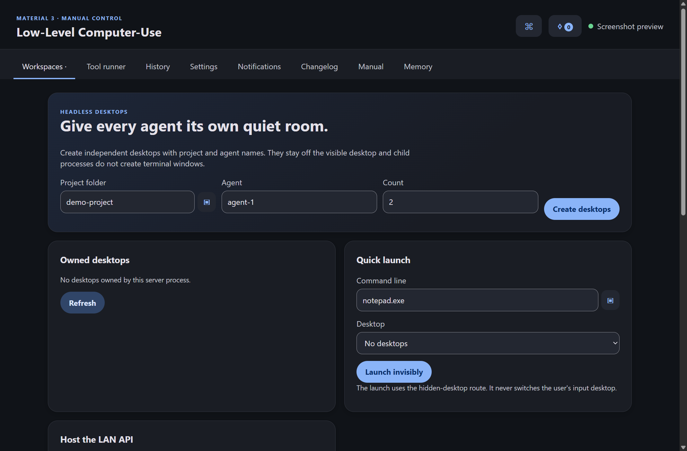
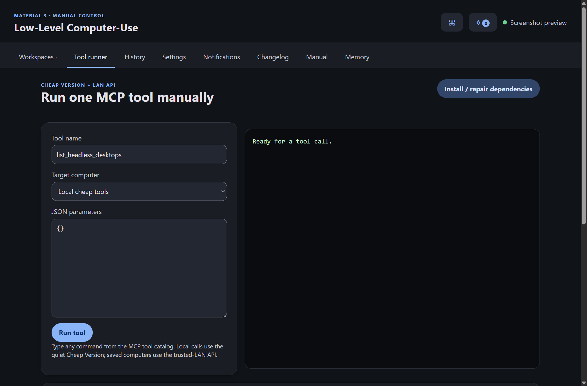
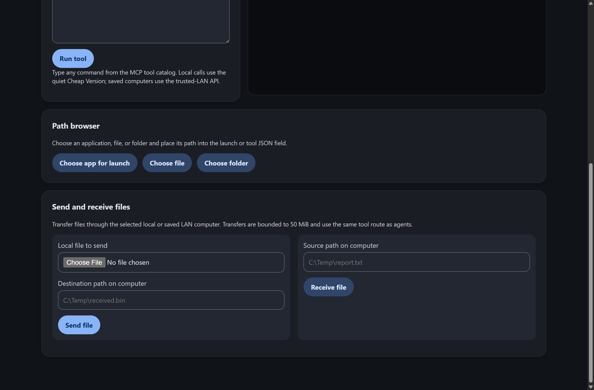
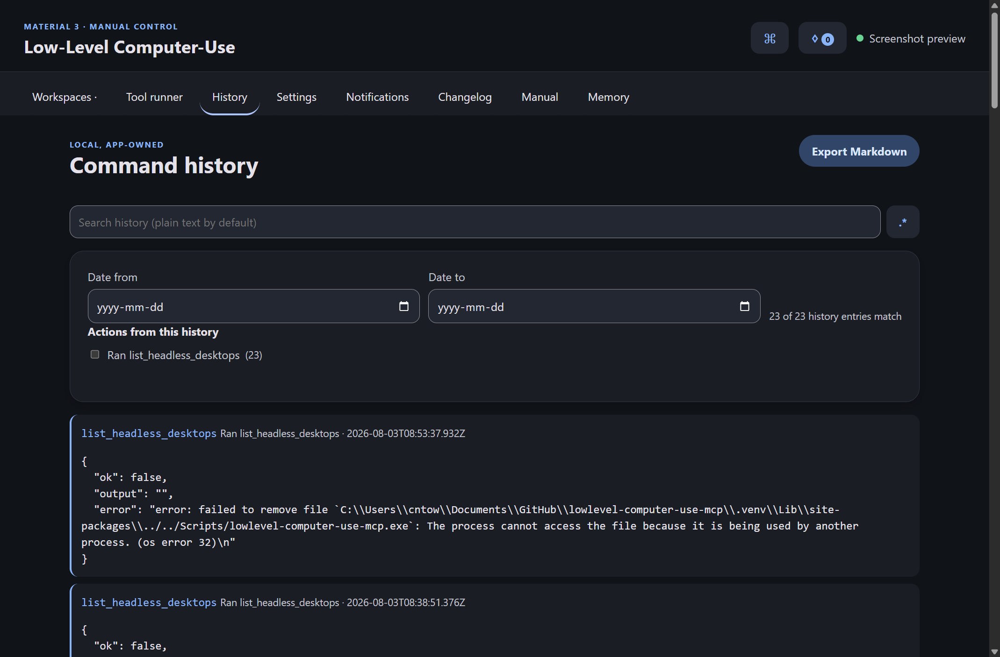
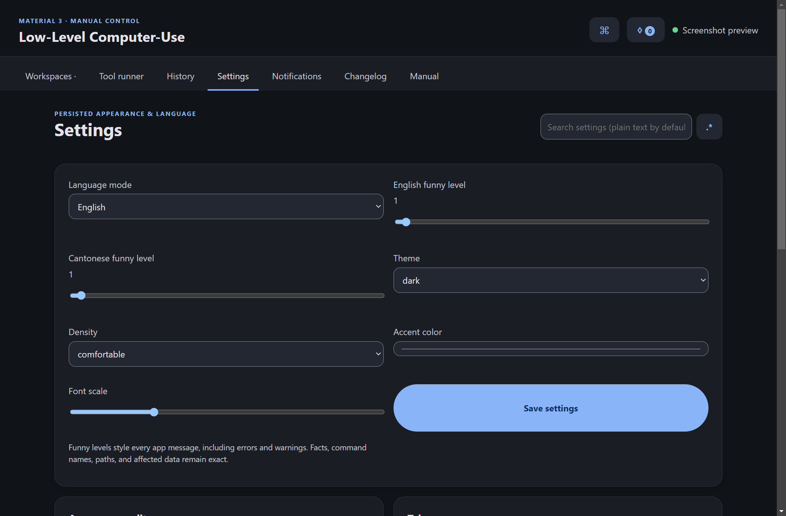
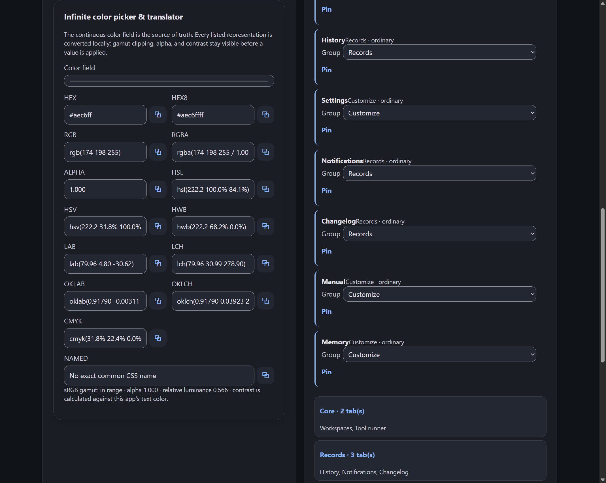
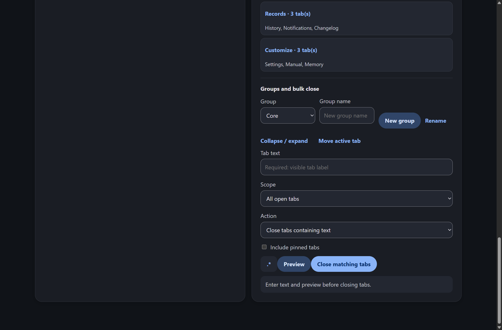
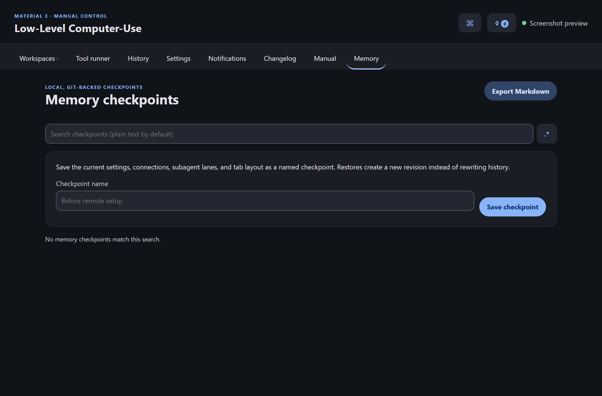
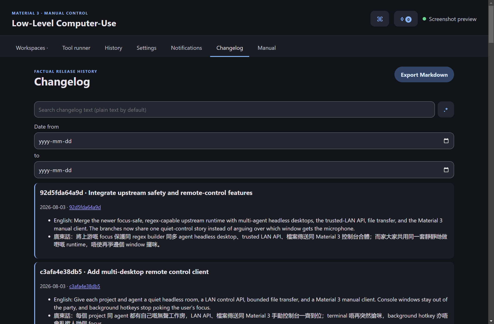

# lowlevel-computer-use-mcp

> **Real GUI apps. Zero desktop clutter.** Give an MCP agent a desktop of its own.

[Explore the project site](https://codingmachineedge.github.io/lowlevel-computer-use-mcp/) · [Jump to quick start](#quick-start-gui-installer--fully-automatic)

The headline feature is **headless desktop automation**: run full native GUI
applications on an invisible Windows desktop or Linux Xvfb display, then let an
agent capture, click, and type without stealing focus or disturbing the desktop
you are using.

```text
create isolated desktop → launch real GUI app → automate off-screen → capture & verify
```

When a login or other human-only step is unavoidable, the agent can temporarily
reveal that desktop. A non-dismissible top banner tells the user exactly what to
do, and an **EMERGENCY EXIT** button immediately returns to the normal desktop.

## Why headless-with-GUI?

- 🫥 **Invisible by default** — apps retain a real GUI while staying off your visible desktop
- 🎯 **No focus stealing** — background mouse, keyboard, and control targeting keep your workflow uninterrupted
- 📸 **Still observable** — capture individual windows even while they are occluded, unfocused, or off-screen
- 🧑‍💻 **Safe human handoff** — reveal the desktop only when needed, with persistent instructions and emergency return
- 🪟 **Native on Windows** — isolated Win32 desktops via `CreateDesktop` and `SwitchDesktop`
- 🐧 **Native on Linux** — virtual GUI displays backed by Xvfb

## Everything else agents need

This low-level computer-use MCP server works with Codex, Claude Code, Claude
Desktop, and other MCP clients. Headless desktops are the centerpiece; the same
server also exposes the primitives needed to automate and verify them end to end:

- 🫥 **Headless GUI** — run real GUI apps on an off-screen desktop; show them only when a human login is needed
- 🎯 **Background / unfocused targeting** — drive a specific window via Win32 messages **without focusing it**
- 🧩 **Multi-agent desktops** — create and list independent named desktops in one request; namespace them by project and agent
- 🧑‍🤝‍🧑 **Subagent lanes** — persist project/agent namespaces so later agents can pick up the same quiet room
- 🚫 **Quiet process policy** — Windows child processes use hidden startup information and CREATE_NO_WINDOW; headless launches never create a terminal or switch the user's input desktop
- 📸 **Screenshots** — all monitors, one monitor, a region, or **one window via PrintWindow**
- 🖱️ **Mouse** — move, click, double/right/middle click, drag, scroll, cursor position
- ⌨️ **Keyboard** — type text, press hotkey combinations (Ctrl+C, Alt+Tab, …)
- 🖥️ **Shell commands** — run arbitrary system commands and capture output
- 🪟 **Windows** — list, move, resize, focus, minimize, maximize, restore, close, **show/hide**
- ⚙️ **Processes** — list running processes; kill by PID or name
- ✂️ **Cropping** — crop any saved image to a sub-region
- 🎥 **Screen recording** — record a monitor or region to mp4 in the background
- 🛡️ **Run-as-admin** — per-command UAC elevation or whole-server elevation
- 🚀 **Quiet client registration** — `pythonw.exe` keeps the compatibility MCP stdio entry out of the user's desktop; no HTTP logon service is installed
- 🟢 **AutoHotkey add-in** — run AHK scripts; `ControlSend`/`ControlClick` for rock-solid background input
- 🐧 **Cross-platform** — the same tools work natively on **Linux** (X11 via xdotool/wmctrl), with **Xvfb** virtual displays for headless-with-GUI
- 🌀 **Ephemeral WSL** — on a Windows host, spin up a throwaway Linux distro on demand, run commands, tear it down
- 🧩 **GUI installer** — one window that installs everything automatically
- 💸 **Cheap Version** — the primary local command-line route that runs any registered tool directly from CLI args, without MCP or a listening server

> ⚠️ **This server performs real, unsandboxed actions on the host machine** —
> clicking, typing, killing processes and running shell/elevated commands with your
> user's privileges. Only register it in environments where that is acceptable.

<details><summary>Sanitized shared agent-instructions mirror</summary>

This public repository carries a sanitized mirror of the shared agent
instructions. The canonical instructions remain the source of truth.

- Apply safety, accessibility, language, Material 3, appearance, search, tabs,
  export, notification, and version-history rules to every app and Pages
  surface, including nested dialogs and documentation.
- Use headless computer-use first; keep child processes console-free and never
  steal focus. Use visible handoff only when required, with an emergency exit.
- Keep secrets out of chat, source, arguments, URLs, logs, screenshots, and
  history. Use a temporary secure intake for sensitive values.
- Use `git` and `gh` for repository work. Preserve unrelated changes, commit
  and push intended work to the default branch, prove the pushed SHA, and never
  force-push or delete unmerged work.
- Keep README, feature articles, roadmap, handoff, wiki, Pages, API docs,
  changelog, screenshots, issue evidence, and releases truthful and current.
- Ship English, playful Hong Kong Cantonese, and bilingual modes with two
  persisted funny-level controls; humour changes voice, never facts.
- Provide a bounded local regex builder beside every search, complete tabs and
  bulk actions, accessible Material 3 appearance editing, command palette,
  export, local append-only revisions, and restore-as-new-revision behavior.
- Test before publishing one unique real release per push/dispatch, verify
  hosted checks and live endpoints, and use only verified local/catalog assets.

</details>

## Electron manual client

The Electron client is the local GUI for the same MCP surface. It creates
project/agent headless rooms, hosts the trusted-LAN API, saves named computer
connections for later agents, runs any tool by name, keeps local history, and
provides persisted language, funny-level, tab, appearance, notification, and
changelog controls. The older [GitHub Pages site](https://codingmachineedge.github.io/lowlevel-computer-use-mcp/)
remains the primary explanatory guide; the detailed feature articles live in
[`docs/features`](docs/features/README.md).

Run the manual client from `electron/` with `npm install` followed by `npm start`.
Its startup path repairs the Electron runtime when the package is present but
its binary cache is missing. Quick launch has an inline application browser;
the Tool runner has file and folder browsers that write safe JSON path values.
The Tab manager supports named groups, persistent collapse state, searchable
context menus, and reviewable bulk close by visible tab text with optional regex.
The Memory page saves settings, connections, subagent lanes, and tab layout as
named local checkpoints; restores create new Git-backed revisions in app data.
The Tool runner also sends and receives bounded files through the selected local
or saved LAN computer, using a user-controlled native Save dialog for receives.
The Settings appearance editor also supports per-target typography, spacing,
translated colors, built-in presets, and saved user presets with reset and
export/import.
Each build also carries a factual public dim-sum code name and catalog-photo link
in the Manual and Changelog surfaces; the photo is referenced, never copied.
The Windows release target is Squirrel.Windows and the local packaging command
is `npm run package`.

### Real Electron screenshots

These captures come from the Electron renderer's offscreen capture mode, so no
terminal or visible desktop window was opened while they were produced.



















---

## Tools

| Tool | Description |
|------|-------------|
| `get_screen_size` | Primary screen resolution |
| `get_cursor_position` | Current mouse position |
| `mouse_move` | Smoothly move cursor to `(x, y)` |
| `mouse_click` | Smoothly move then click; **`hwnd`/`window_title` → background click (client coords)** |
| `mouse_drag` | Press-drag-release between two points |
| `mouse_scroll` | Scroll the wheel up/down |
| `type_text` | Type text; **`hwnd`/`window_title` → background WM_CHAR** |
| `press_keys` | Press a key / hotkey combo, e.g. `["ctrl","c"]` |
| `run_command` | Run a shell command, capture output/exit code |
| `list_windows` | List top-level windows (title, handle, geometry, state) |
| `get_active_window` | Info about the focused window |
| `move_window` / `resize_window` | Move / resize a window |
| `window_action` | focus / minimize / maximize / restore / close |
| `show_window` / `hide_window` | Bring a window forward (e.g. for login), then hide it again |
| `list_child_windows` | Enumerate a window's child controls (class, text, rect, handle) |
| `win_set_control_text` | Set a control's text via WM_SETTEXT (reliable background text) |
| `win_send_keys` | Post key presses to a window without focusing it |
| `list_processes` / `kill_process` | List processes; kill by PID or name |
| `screenshot` | Monitor/region/**single-window (PrintWindow)** capture to PNG |
| `crop_image` | Crop an existing image to a box |
| `start_screen_recording` / `stop_screen_recording` / `recording_status` | mp4 recording |
| `create_headless_desktop` | Create an off-screen desktop |
| `create_headless_desktops` | Create multiple independent desktops with explicit names or a generated project/agent prefix |
| `list_headless_desktops` | List desktops owned by this server process and their window counts |
| `launch_on_headless_desktop` | Launch a GUI app onto it |
| `list_headless_windows` | List windows on the off-screen desktop |
| `show_headless_desktop` / `hide_headless_desktop` | Temporarily make it interactive (login), then hide |
| `close_headless_desktop` | Release the off-screen desktop handle |
| `ahk_status` | Whether AutoHotkey is installed |
| `run_ahk` | Run an inline AutoHotkey script |
| `ahk_control_send` | AHK ControlSend to a background window/control |
| `is_admin` | Whether the server is running elevated |
| `run_command_as_admin` | Run a shell command elevated (UAC prompt) |
| `install_startup` / `uninstall_startup` / `startup_status` | Boot auto-start |
| `linux_status` | Linux: X11 automation tooling availability |
| `create_virtual_display` | Linux: start an Xvfb headless display |
| `launch_on_virtual_display` | Linux: launch a GUI app on the Xvfb display |
| `list_virtual_display_windows` | Linux: windows on the Xvfb display |
| `screenshot_virtual_display` | Linux: capture the whole Xvfb display |
| `stop_virtual_display` | Linux: stop the Xvfb display |
| `wsl_status` / `wsl_list_distros` | WSL availability + installed distros |
| `wsl_create_temp` | Provision a throwaway WSL distro (Alpine by default) |
| `wsl_run` | Run a command inside a WSL distro |
| `wsl_list_temp` / `wsl_destroy` / `wsl_destroy_all_temp` | Manage throwaway distros |

Every tool returns a JSON string `{"ok": true, ...}` on success or
`{"ok": false, "error": "..."}` on failure.

---

## Quick start (GUI installer — fully automatic)

The easiest path. It installs `uv` if missing, runs `uv sync`, registers a quiet
stdio compatibility server with the supported clients, and removes the retired
HTTP/logon registration so local tool calls use the Cheap Version.

Clone the repo:

```bash
git clone https://github.com/codingmachineedge/lowlevel-computer-use-mcp.git
```

Enter it:

```bash
cd lowlevel-computer-use-mcp
```

Sync once, then launch the GUI-subsystem installer directly. This avoids creating
a terminal window for the installer itself:

```powershell
uv sync
.\.venv\Scripts\lowlevel-computer-use-mcp-installer.exe
```

Then **restart Claude Code / Codex / OpenCode** so they reload the quiet
compatibility registration. The installer does not create a persistent HTTP
server or a Windows logon launcher.

---

## Manual install

The normal local route is the Cheap Version; it starts no MCP transport and no
HTTP listener:

```bash
uv run lowlevel-computer-use-cheap --list
```

For a client that still needs MCP stdio, install dependencies and start the
compatibility server:

```bash
uv run lowlevel-computer-use-mcp
```

Or with pip — install in editable mode:

```bash
pip install -e .
```

Then run it:

```bash
lowlevel-computer-use-mcp
```

## Optional legacy Remote LAN API

The server already exposes MCP over Streamable HTTP. On the computer being
controlled, bind it to the LAN interface:

```bash
uv run lowlevel-computer-use-mcp --http --legacy-http --host 0.0.0.0 --port 8765
```

Agents on the trusted LAN connect to `http://<computer-ip>:8765/mcp`; health
checks use `http://<computer-ip>:8765/health`. This mode intentionally has no
API key because it is designed for a trusted home/LAN network. Anyone who can
reach the port can control the computer with the server's user privileges, so
use Windows Firewall or a private VLAN and never forward port `8765` to the
public internet.

This compatibility transport is never enabled by the installer, GUI, or Windows
logon startup. The Electron client can save a named connection and route manual tool calls to
`POST http://<computer-ip>:8765/api/execute` with a JSON body such as:

```json
{"tool":"list_headless_desktops","arguments":{}}
```

The Electron manual client uses the Cheap Version for local tool calls and starts
compatibility child processes with hidden Windows startup flags, so dependency
installation and manual tool calls do not open terminal windows.

Captures (screenshots, recordings) are written to
`~/lowlevel-computer-use-captures` by default. Override with the
`LOWLEVEL_CU_CAPTURE_DIR` environment variable.

---

## Registering with clients

Replace the path below with wherever you cloned this repo. These entries are the
quiet compatibility MCP stdio path; use the Cheap Version directly for ordinary
local tool calls.

### Claude Code

Register at user scope (one line):

```bash
claude mcp add lowlevel-computer-use --scope user -- "C:\path\to\lowlevel-computer-use-mcp\.venv\Scripts\pythonw.exe" -m lowlevel_computer_use_mcp.server
```

Or add this to `~/.claude.json` under `mcpServers`:

```json
{
  "mcpServers": {
    "lowlevel-computer-use": {
      "command": "C:\\path\\to\\lowlevel-computer-use-mcp\\.venv\\Scripts\\pythonw.exe",
      "args": ["-m", "lowlevel_computer_use_mcp.server"]
    }
  }
}
```

### Codex (OpenAI Codex CLI)

Add this block to `~/.codex/config.toml`:

```toml
[mcp_servers.lowlevel-computer-use]
command = "C:\\path\\to\\lowlevel-computer-use-mcp\\.venv\\Scripts\\pythonw.exe"
args = ["-m", "lowlevel_computer_use_mcp.server"]
startup_timeout_sec = 60
```

### YOLO mode (auto-approve, no permission prompts)

The GUI installer enables this by default. To do it manually for Claude Code, add a
wildcard allow rule for this server's tools to `~/.claude/settings.json`:

```json
{ "permissions": { "allow": ["mcp__lowlevel-computer-use__*"] } }
```

For Codex, set the global approval policy in `~/.codex/config.toml`:

```toml
approval_policy = "never"
```

> ⚠️ YOLO means every tool runs without asking — including destructive ones
> (`kill_process`, `run_command`, `run_command_as_admin`, `wsl_destroy`). Only enable
> it if you trust the agents driving this server.

---

## Cheap Version (primary local route)

The **Cheap Version** is the primary local route. It runs the **exact same
registered tool functions** in-process and prints the JSON result — no client,
transport, HTTP listener, or persistent server connection involved. MCP stdio and
the HTTP API remain compatibility paths for clients that explicitly require them.

List every available tool:

```bash
uv run lowlevel-computer-use-cheap --list
```

Take a screenshot:

```bash
uv run lowlevel-computer-use-cheap screenshot --monitor 1
```

Double-click at a point:

```bash
uv run lowlevel-computer-use-cheap mouse_click --x 960 --y 540 --clicks 2
```

Press a hotkey (values are parsed as JSON, so lists work):

```bash
uv run lowlevel-computer-use-cheap press_keys --keys '["ctrl","s"]'
```

Run a shell command:

```bash
uv run lowlevel-computer-use-cheap run_command --command "ipconfig /all"
```

Pass a whole argument object as JSON:

```bash
uv run lowlevel-computer-use-cheap screenshot --json '{"window_title":"Notepad"}'
```

The same thing is also available as a subcommand of the main entry point:

```bash
uv run lowlevel-computer-use-mcp cheap get_screen_size
```

Every parameter from the [Tool Reference](#tools) is accepted as `--<param> <value>`
(or via `--json`). Output is the identical `{"ok": true, ...}` JSON the MCP tools return.

---

## Agent skill — every feature documented

A companion **skill** (`skills/lowlevel-computer-use/`) teaches agents the entire
toolset: a top-level `SKILL.md` plus `reference/TOOLS.md` (exhaustive per-tool
parameters), `reference/WORKFLOWS.md` (end-to-end recipes) and
`reference/PLATFORMS.md` (Windows/Linux specifics & gotchas). Install it for Claude
Code by copying it into your skills directory:

```bash
cp -r skills/lowlevel-computer-use ~/.claude/skills/
```

The MCP server also ships condensed instructions inline, so any MCP client gets a
full feature overview on connect.

---

## Background / unfocused window targeting

Headless execution is the default operating model. `mouse_click`, `type_text` and
`screenshot` accept `hwnd` or `window_title`. When
set, input is delivered to that exact window via Win32 messages **without focusing
or foregrounding it**, and `screenshot` uses `PrintWindow` so the window is captured
even if it's behind others, minimized, or on an off-screen desktop.

Typical flow:

1. Find the window:

```jsonc
list_windows { "title_filter": "Notepad" }
```

2. Find the control to target:

```jsonc
list_child_windows { "window_title": "Notepad" }
```

3. Set its text in the background (most reliable for edit controls):

```jsonc
win_set_control_text { "hwnd": 23924320, "text": "typed without focus" }
```

4. Or click it in the background (x/y are **client** coords of the window):

```jsonc
mouse_click { "window_title": "Notepad", "x": 200, "y": 120 }
```

5. See the result without bringing it forward:

```jsonc
screenshot { "window_title": "Notepad" }
```

> Caveat: message-based input is ignored by some apps (raw input / DirectInput /
> physical-key-state checks). Try **AutoHotkey** `ahk_control_send`; do not silently
> fall back to foreground input while the user is active.

Foreground mouse, typing, hotkeys, window activation, and interactive desktop
switches are focus-protected. They return `focus_protected: true` unless the call
includes `confirm_focus_disruption: true` after the user explicitly requests a
visible handoff.

---

## Headless-but-with-GUI mode

Run a real GUI app on an off-screen Win32 desktop so it never touches your visible
desktop, then automate and screenshot it via the background tools.

Create the off-screen desktop:

```jsonc
create_headless_desktop { "name": "work" }
```

Launch an app onto it:

```jsonc
launch_on_headless_desktop { "name": "work", "command": "notepad.exe" }
```

List its windows (to get handles):

```jsonc
list_headless_windows { "name": "work" }
```

Each returned window includes its `handle`, `process_id`, `thread_id`, `dpi`,
`title`, `class`, `width`, and `height`. Identity and DPI are sampled inside the
desktop enumeration callback; an unavailable value is reported as `0` without
omitting the window.

Capture a window on it (works even though it's off-screen):

```jsonc
screenshot { "hwnd": 2495156 }
```

### Showing it for an interactive login, then hiding again

Some steps (sign-in) need a human. Temporarily switch the live screen to the
off-screen desktop:

```jsonc
show_headless_desktop {
  "name": "work",
  "instruction": "Sign in to the app, then tell the agent you are done.",
  "confirm_focus_disruption": true
}
```

The interactive desktop has a topmost banner that cannot be closed. It displays
the instruction and includes an **EMERGENCY EXIT** button that immediately returns
the user to the normal desktop. After the user finishes, switch back normally:

```jsonc
hide_headless_desktop { "name": "work" }
```

For an ordinary hidden window on the normal desktop, use `show_window` /
`hide_window` instead:

```jsonc
show_window { "window_title": "My App", "confirm_focus_disruption": true }
```

```jsonc
hide_window { "window_title": "My App" }
```

---

## AutoHotkey add-in

Optional but powerful. AHK's `ControlSend`/`ControlClick` drive background windows
very reliably, and `run_ahk` is a full scripting escape hatch.

Install AutoHotkey (one line):

```bash
winget install -e --id AutoHotkey.AutoHotkey
```

Check the server can find it:

```jsonc
ahk_status {}
```

Send text to a background window by HWND:

```jsonc
ahk_control_send { "text": "hello", "window": "ahk_id 0x1A2B3C" }
```

Run an arbitrary AHK script (must call `ExitApp`):

```jsonc
run_ahk { "code": "ControlSendText \"hi\", , \"ahk_exe notepad.exe\"\nExitApp" }
```

Point the server at a specific AHK exe by setting `LOWLEVEL_CU_AHK` to its path.

---

## Macros — save repeated sequences as Skills

When you run a multi-step UI sequence the user is likely to repeat, **don't leave
it as ad-hoc tool calls — capture it as a reusable macro Skill.** The server tells
agents to do this automatically; see
[`macros/MACRO_SKILL_TEMPLATE.md`](macros/MACRO_SKILL_TEMPLATE.md) for the template
and rules (resolve handles at run time, prefer background tools, parameterize the
variable parts, verify with a screenshot).

---

## Linux (native X11)

The mouse, keyboard, screenshot, process, recording, **window management** and
**background/unfocused targeting** tools all work natively on Linux. Window control,
background input and per-window capture use X11 CLI tools; on Linux `hwnd` is an X11
window id.

Install the X11 helpers (Debian/Ubuntu):

```bash
sudo apt install xdotool wmctrl x11-utils imagemagick xvfb
```

Check what the server can see:

```jsonc
linux_status {}
```

Background-type into a window without focusing it (X11):

```jsonc
type_text { "window_title": "Editor", "text": "typed in the background" }
```

> Caveat: X11 background typing uses `XSendEvent`; most apps accept it, but a few
> (notably `xterm` with its default `allowSendEvents: false`) ignore synthetic
> events. For those, use Xvfb or report the limitation; do not steal the user's focus.

### Headless-with-GUI on Linux (Xvfb)

Start a virtual display:

```jsonc
create_virtual_display { "display": 99, "width": 1280, "height": 800 }
```

Launch a GUI app onto it:

```jsonc
launch_on_virtual_display { "display": 99, "command": "xterm -e bash" }
```

List its windows:

```jsonc
list_virtual_display_windows { "display": 99 }
```

Drive a window on that display (note the `display` field routes input there):

```jsonc
type_text { "hwnd": 2097164, "display": 99, "text": "hello from headless" }
```

Capture the whole virtual display:

```jsonc
screenshot_virtual_display { "display": 99 }
```

Stop it when done:

```jsonc
stop_virtual_display { "display": 99 }
```

---

## Ephemeral WSL (Linux on a Windows host)

On Windows, spin up a throwaway Linux distro on demand to run Linux software, then
tear it down. By default a tiny Alpine minirootfs is downloaded and imported in
seconds — your existing distros are untouched.

Check WSL is available:

```jsonc
wsl_status {}
```

Provision a throwaway distro (downloads latest Alpine minirootfs):

```jsonc
wsl_create_temp {}
```

Run a command in it (use the name returned above):

```jsonc
wsl_run { "distro": "llcu-tmp-1782754365-53b8", "command": "apk add --no-cache curl && curl --version" }
```

Tear it down (irreversible — deletes the distro):

```jsonc
wsl_destroy { "name": "llcu-tmp-1782754365-53b8" }
```

You can also clone an existing distro instead of downloading:

```jsonc
wsl_create_temp { "clone_from": "Ubuntu-24.04" }
```

---

## Run-as-admin mode

Per-command elevation — call `run_command_as_admin` (UAC prompt unless already
elevated):

```jsonc
run_command_as_admin { "command": "net session" }
```

Or run the whole server elevated (intended for HTTP mode):

```bash
uv run lowlevel-computer-use-mcp --http --legacy-http --admin
```

Check elevation:

```jsonc
is_admin {}
```

---

## Console-free startup and legacy retirement

The old persistent HTTP/logon launcher is retired. The GUI installer removes its
registration and the legacy HTTP entries from Claude, Codex, and OpenCode. To
repeat that cleanup manually, run:

```bash
uv run lowlevel-computer-use-mcp retire-legacy-startup
```

`install-startup` now refuses by default, so an accidental invocation cannot
bring the old HTTP window back. It accepts `--legacy-http` only as an explicit
compatibility escape hatch for an existing client that cannot yet migrate:

```bash
uv run lowlevel-computer-use-mcp install-startup --legacy-http --port 8765
```

Do not use that compatibility option for normal local calls. Use the Cheap
Version instead. The quiet MCP stdio client registration uses `pythonw.exe`, and
the packaged Electron app starts its local helper with hidden Windows startup
flags; neither path installs a new logon HTTP service.

To inspect or remove any old registration:

```bash
uv run lowlevel-computer-use-mcp startup-status
uv run lowlevel-computer-use-mcp uninstall-startup
```

No new top-level console window is created by the Cheap Version or quiet stdio
registration. Tool-spawned Windows child processes also use `CREATE_NO_WINDOW`
plus `SW_HIDE`. See
[runtime safety](docs/features/runtime-safety/console-free-headless.md).

---

## Local regex builder

The bundled Python `re` builder supports guided literals, character classes,
anchors, groups, alternation and quantifiers, plus raw patterns, flags, sample
text, syntax feedback, captures, copy/export, and plain-text search mode. It
evaluates in a console-free subprocess with strict size, time, and match limits.

```powershell
uv run lowlevel-computer-use-regex-builder --start --literal "ID:" --char-class "0-9" --quantifier "+" --end --sample "ID:42"
```

```powershell
uv run lowlevel-computer-use-regex-builder --pattern "^(?P<word>\\w+)$" --flags m --sample "HongKong`nToronto"
```

Language settings (`en`, `yue`, `bilingual`) and independent English/Cantonese
funny levels (`1..5`) persist only when explicitly changed. Patterns and samples
are never persisted or transmitted. See [regex builder documentation](docs/features/developer-tools/regex-builder.md).

---

## Requirements

- **Python 3.10+**
- **[uv](https://docs.astral.sh/uv/)** (recommended; the GUI installer can bootstrap it)
- **Windows**: mouse/keyboard via `pyautogui`; windows via `pygetwindow`; background
  input + capture + headless desktop via `ctypes`/Win32 (`winio.py`); screenshots via
  `mss`; recording via `imageio` + bundled ffmpeg. Optional: AutoHotkey, WSL.
- **Linux**: mouse/keyboard via `pyautogui` (X11); window mgmt, background input and
  per-window capture via `xdotool`/`wmctrl`/`x11-utils`/ImageMagick (`linuxio.py`);
  headless-with-GUI via `Xvfb`; screenshots/recording via `mss`. Install the X11
  helpers with your package manager (see the Linux section). X11 (or XWayland) session.

## Safety notes

- `run_command`, `run_command_as_admin`, `kill_process`, `run_ahk` and
  `window_action(close)` are marked **destructive**.
- `pyautogui`'s fail-safe is disabled so automation isn't interrupted by the cursor
  reaching a screen corner; be deliberate with coordinates.
- The server has no authentication of its own — it trusts the MCP client that spawns it.

## License

MIT
